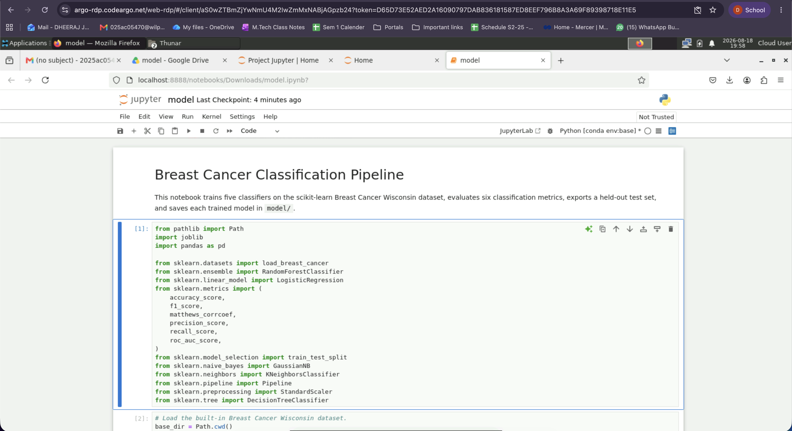
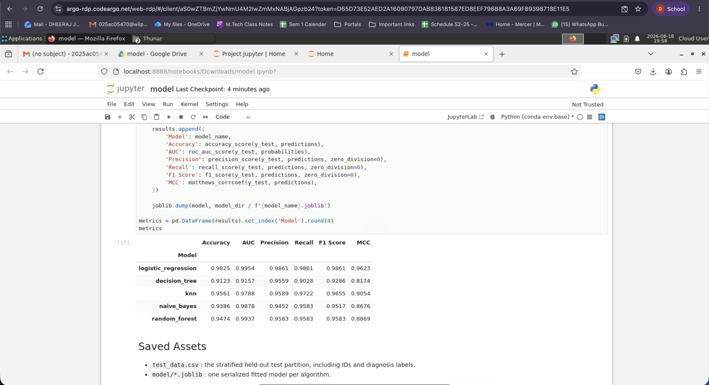
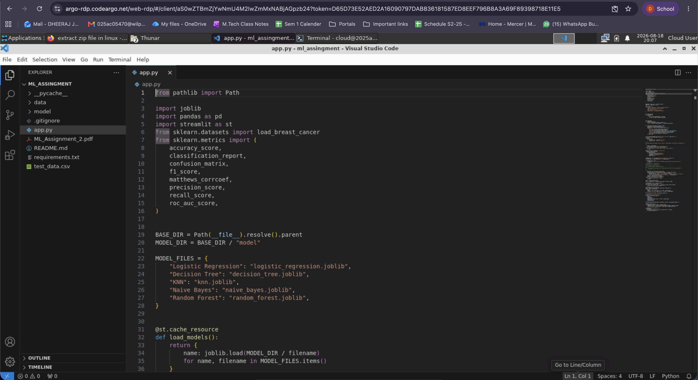
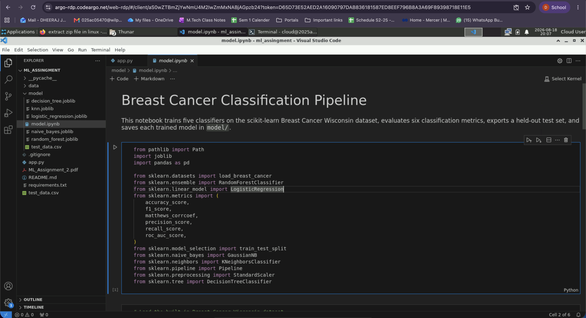
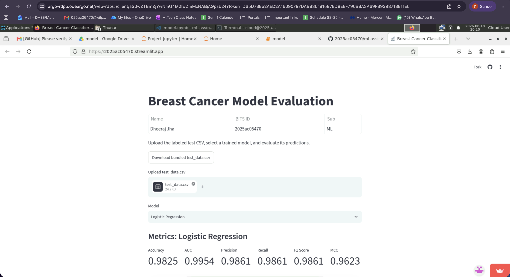
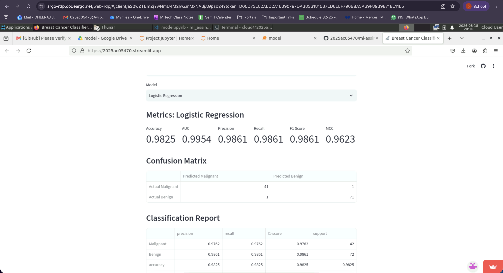
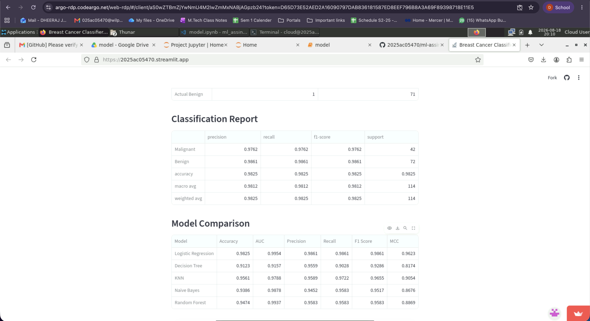

| Name | BITS ID | Subject |
|---|---|---|
| Dheeraj Jha | 2025ac05470 | ML |

**GitHub Repository:** https://github.com/2025ac05470/ml-assingment2

**Streamlit App:** https://2025ac05470.streamlit.app/

---

# Breast Cancer Classification Pipeline - ML Assingment

## Problem Statement

The objective is to classify breast tumors as malignant or benign using machine learning. Five supervised classification algorithms are trained, evaluated with six standard metrics, and made available through an interactive Streamlit application.

## Dataset Description

This project uses the Breast Cancer Wisconsin (Diagnostic) dataset provided by `sklearn.datasets.load_breast_cancer(as_frame=True)`. It contains 569 samples, 30 numeric features, and a binary target:

- `0`: malignant
- `1`: benign

The notebook uses a stratified 80/20 train-test split with `random_state=42`. The held-out 114-row test partition is saved as `test_data.csv`.

## GitHub Repository Link

GitHub repository: `https://github.com/2025ac05470/ml-assingment2`

## Streamlit live URL
URL: https://2025ac05470.streamlit.app/

## Comparison Table

The following results were produced on the held-out test partition:

| Model | Accuracy | AUC | Precision | Recall | F1 Score | MCC |
|---|---:|---:|---:|---:|---:|---:|
| Logistic Regression | 0.9825 | 0.9954 | 0.9861 | 0.9861 | 0.9861 | 0.9623 |
| Decision Tree | 0.9123 | 0.9157 | 0.9559 | 0.9028 | 0.9286 | 0.8174 |
| KNN | 0.9561 | 0.9788 | 0.9589 | 0.9722 | 0.9655 | 0.9054 |
| Naive Bayes | 0.9386 | 0.9878 | 0.9452 | 0.9583 | 0.9517 | 0.8676 |
| Random Forest | 0.9474 | 0.9937 | 0.9583 | 0.9583 | 0.9583 | 0.8869 |

## Observations Table

| Model | Observation | Overall Winner |
|---|---|---|
| Logistic Regression | Best overall results, including the highest Accuracy, AUC, F1 Score, and MCC. | **Yes** |
| Decision Tree | Lowest overall performance and lowest AUC, F1 Score, and MCC among the five models. | No |
| KNN | Strong balanced performance with the second-highest Accuracy and F1 Score. | No |
| Naive Bayes | High AUC, but lower Accuracy and MCC than the leading models. | No |
| Random Forest | High AUC and stable balanced metrics, but slightly below Logistic Regression. | No |

**Overall Winner: Logistic Regression**, based on the strongest combined test-set performance across the six reported metrics.

## Dependencies

Install all dependencies with:

```bash
pip install -r requirements.txt
```

## How to Run Locally

From the project directory, create and activate the Conda environment, install the dependencies, and start the Streamlit application:

```bash
conda create -n ml_assingment python=3.12
conda activate ml_assingment
python -m pip install -r requirements.txt
streamlit run app.py
```

Open the local URL displayed in the terminal, usually `http://localhost:8501`.

## Run the Application

```bash
streamlit run app.py
```

Upload `test_data.csv`, select any of the five trained models, and view its metrics, confusion matrix, and classification report.

## Repository Contents

```text
.
├── app.py
├── model/
│   ├── decision_tree.joblib
│   ├── knn.joblib
│   ├── logistic_regression.joblib
│   ├── naive_bayes.joblib
│   ├── random_forest.joblib
│   └── model.ipynb
├── requirements.txt
└── test_data.csv
```

## Screenshot














